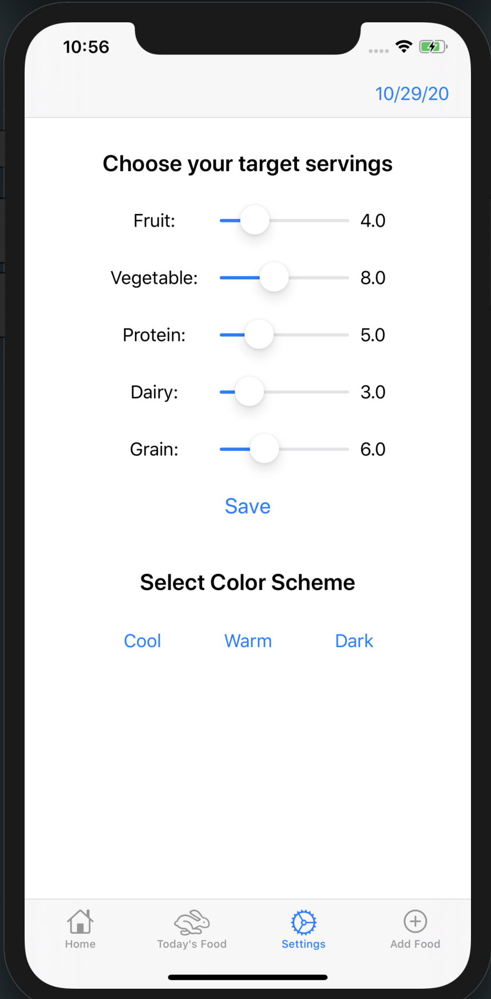

# Senior-Capstone

## Why Cheo?

We noticed a common problem among college students and young adults. They consider "dieting" to be equivalent to neglecting the food that their bodies need. Apps like MyFitnessPal and Noom only promote this unhealthy mindset by basing a person's dieting goals primarily on number of calories. With calorie based goals, someone could reach their goals by eating 2000 calories of ice cream!

Clearly there is a need for a new approach to dieting apps. With Cheo, our primary focus is to promote well balanced meals. Our goals are based on serving sizes for each of the five major food groups - **because a healthy diet consists of more than one number!**

## Git Cheat Sheet

- [Git Cheat Sheet](https://education.github.com/git-cheat-sheet-education.pdf)

## Our Branches

1. `master` branch will hold the code that was demonstated at our latest "progress report"
   - Should always build and run successfully
1. `develop` branch is what we are working on since our latest "progress report"
   - Never directly modify this branch
   - Should always build and run successfully
1. Feature branches are used to add/modify individual features.
   - Find a task from [the project scrum board](https://github.com/509maddy/Senior-Capstone/projects)
   - Create branch from `develop`, name your branch `task_number-description`
   - Next, make your changes to this branch
   - Create a pull request to merge your feature branch into develop. If there are merge conflicts you need to fix them (we are willing to help if needed).
   - Someone else accept the PR. This way we have another set of eyes on the code.
   - After the PR is accepted, the creator of the branch needs to merge and delete their branch.

## Environment Reqiurements

1. To run our application, you must be running XCode version 11.xx. Note that XCode version 12 will not build properly
1. All screens are intendend to work on all iPhone sizes. However, in the case that a screen has not been configured for a smaller screensize yet, it is suggested to use the iPhone 11 simulator

## Walkthrough

### Homescreen

On the homescreen, the user can see their progress within each food group throughout the day. Each food group has a different target number of serving sizes. This can be adjusted on the "settings" page

### Today's Food

On the today's food screen, users have a list view of everything that they have eaten that day. Users can click on a food to see a break down of how many servings of each food group that food is has.

### Settings

On the settings screen, users can modify their target goals for each category. Future steps can be found under Progress Report 2 > Work to Be Done > Suggested Daily Goals

### Add Food

On the add food page, users can add food records. They are promted with tickers to increase/decrease the number of servings sizes that their food record contains. Users can click "What's a Serving?" to learn more about how to estimate a serving size.

